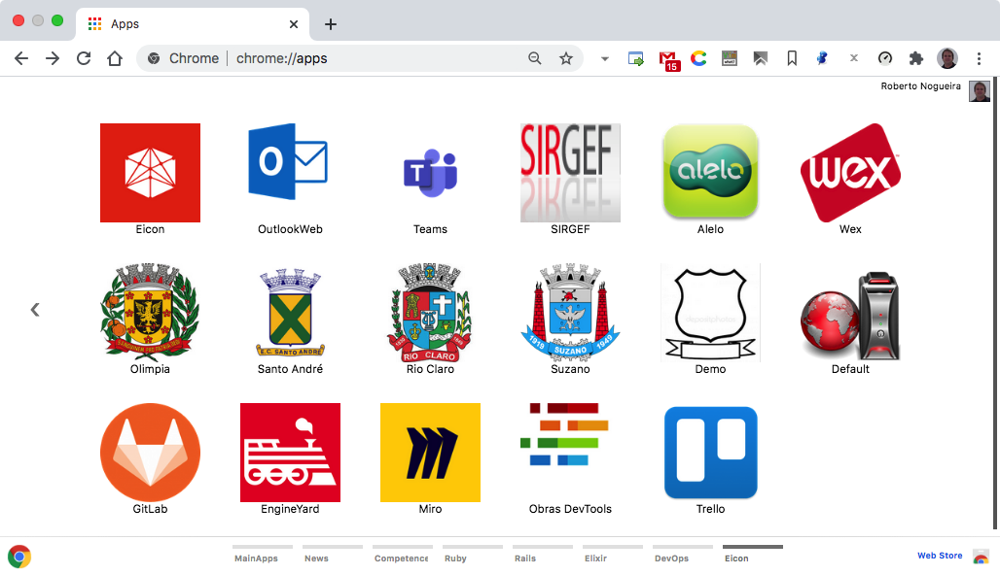
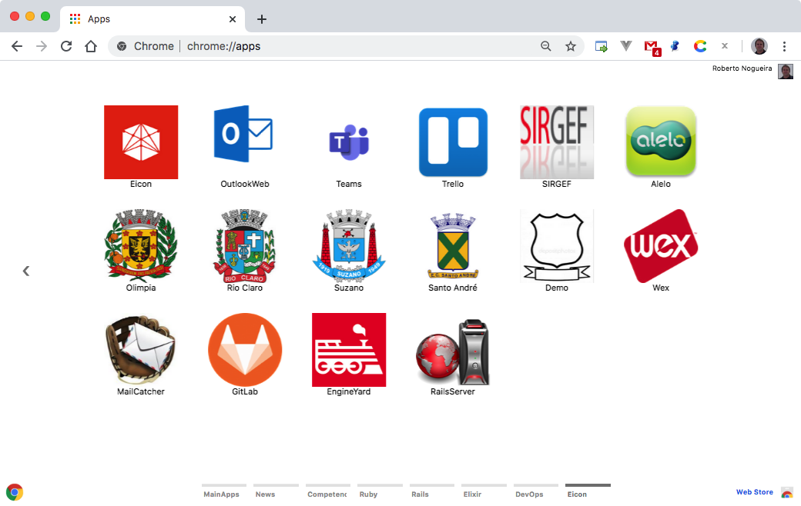

# Chrome Apps for Eicon



## Installation

### 1. Clone this repository and see its contents.
Open a terminal give the following command:

```bash
$ git clone https://github.com/enogrob/chromeapps-eicon.git
```

As we can see a subdirectory is created for each Eicon app.

```bash
$ ls -la
total 400
drwxr-xr-x@   8 enogrob  staff    272 Oct  3 17:01 .
drwxr-xr-x@ 296 enogrob  staff  10064 Oct  3 17:01 ..
drwxr-xr-x   12 enogrob  staff    408 Oct  3 17:01 .git
-rw-r--r--    1 enogrob  staff     13 Oct  3 17:01 .gitignore
-rw-r--r--@   1 enogrob  staff      0 Oct  3 17:01 Icon?
-rw-r--r--@   1 enogrob  staff   1823 Oct  3 17:01 README.md
drwxr-xr-x   26 enogrob  staff    884 Oct  3 17:01 apps
drwxr-xr-x    4 enogrob  staff    136 Oct  3 17:01 images

$ tree -L 1 apps/
apps
├── Eicon-Alelo
├── Eicon-Default
├── Eicon-Demo
├── Eicon-DemoHomolog
├── Eicon-EngineYard
├── Eicon-GitLab
├── Eicon-Homepage
├── Eicon-Miro
├── Eicon-NGrok
├── Eicon-ObrasDevTools
├── Eicon-Olimpia
├── Eicon-OlimpiaHomolog
├── Eicon-RioClaro
├── Eicon-RioClaroHomolog
├── Eicon-SIRGEF
├── Eicon-SantoAndre
├── Eicon-SantoAndreHomolog
├── Eicon-Slack
├── Eicon-Suzano
├── Eicon-SuzanoHomolog
├── Eicon-Teams
├── Eicon-Trello
├── Eicon-VcareEmail
└── Eicon-Wex

21 directories, 0 file
$
```

### 2. Open Chrome with the following url:
In order to load the `Chrome Apps` for Eicon, check `Developer Mode` and press `Load unpacked extension...` to load each App selecting its corresponding directory inside `apps` e.g. `Eicon-Homepage`, and then repeat that for the wanted apps.

```
chrome://extensions/
```

### 3. After load the Chrome Apps wanted for Eicon, Chrome will look like the screenshot below:

