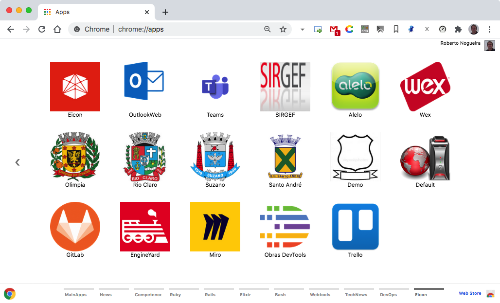

# Chrome Apps for Eicon


## Installation

### 1. Clone this repository and see its contents.
Open a terminal give the following command:

```bash
$ git clone https://github.com/enogrob/chromeapps-eicon.git
```

As we can see a subdirectory is created for each Rails app.

```bash
[TODAY (master)]$ ls -la
total 400
drwxr-xr-x@   7 enogrob  staff   238 Apr 14 12:48 .
drwxr-xr-x@ 258 enogrob  staff  8772 Apr 14 12:31 ..
-rw-r--r--    1 enogrob  staff    13 Apr 14 12:31 .gitignore
-rw-r--r--@   1 enogrob  staff     0 Apr 14 12:31 Icon?
-rw-r--r--    1 enogrob  staff  1991 Apr 14 12:49 README.md
drwxr-xr-x   23 enogrob  staff   782 Apr 14 12:48 apps
drwxr-xr-x    5 enogrob  staff   170 May 31  2016 images

$ tree -L 1 apps/
├── Eicon-Alelo
├── Eicon-Demo
├── Eicon-DemoHomolog
├── Eicon-EngineYard
├── Eicon-GitLab
├── Eicon-Homepage
├── Eicon-Olimpia
├── Eicon-OlimpiaHomolog
├── Eicon-RailsServer
├── Eicon-RioClaro
├── Eicon-RioClaroHomolog
├── Eicon-SIRGEF
├── Eicon-SantoAndre
├── Eicon-SantoAndreHomolog
├── Eicon-Slack
├── Eicon-Suzano
├── Eicon-SuzanoHomolog
├── Eicon-Teams
├── Eicon-Trello
├── Eicon-VcareEmail
└── Eicon-Wex

21 directories, 0 file
$
```

### 2. Open Chrome with the following url:
In order to load the `Chrome Apps` for Eicon, check `Developer Mode` and press `Load unpacked extension...` to load each App selecting its corresponding directory inside `apps` e.g. `Eicon-Homepage`, and then repeat that for the wanted apps.

```
chrome://extensions/
```

### 3. After load the Chrome Apps wanted for Eicon, Chrome will look like the screenshot below:

